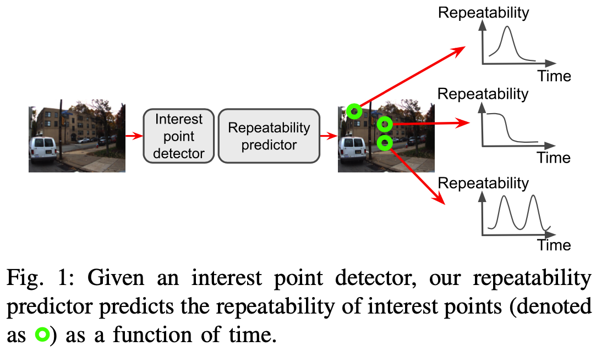

# [Learning to Predict Repeatability of Interest Points](https://arxiv.org/abs/2105.03578)

**[Anh-Dzung Doan](https://scholar.google.com/citations?user=Ch9rZ_kAAAAJ&hl=en&oi=ao), [Daniyar Turmukhambetov](http://dantkz.github.io/about), [Yasir Latif](https://scholar.google.com/citations?hl=en&user=pGsO6EkAAAAJ), [Tat-Jun Chin](https://scholar.google.com/citations?user=WyqGF10AAAAJ&hl=en&oi=ao) and [Soohyun Bae](https://www.linkedin.com/in/soohyun/) – ICRA 2021**

[Link to paper](https://arxiv.org/abs/2105.03578)  

  

